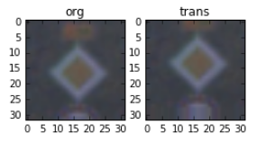
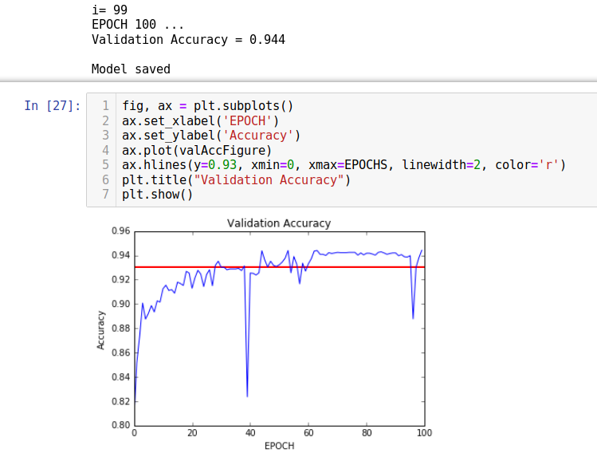
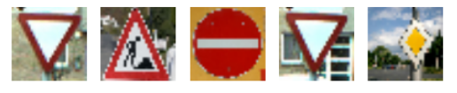

# **Traffic Sign Recognition** 

## Writeup

### You can use this file as a template for your writeup if you want to submit it as a markdown file, but feel free to use some other method and submit a pdf if you prefer.

---

**Build a Traffic Sign Recognition Project**

The goals / steps of this project are the following:
* Load the data set (see below for links to the project data set)
* Explore, summarize and visualize the data set
* Design, train and test a model architecture
* Use the model to make predictions on new images
* Analyze the softmax probabilities of the new images
* Summarize the results with a written report

[//]: # (Image References)

[image1]: ./examples/visualization.jpg "Visualization"
[image2]: ./examples/grayscale.jpg "Grayscaling"
[image3]: ./examples/random_noise.jpg "Random Noise"
[image4]: ./examples/placeholder.png "Traffic Sign 1"
[image5]: ./examples/placeholder.png "Traffic Sign 2"
[image6]: ./examples/placeholder.png "Traffic Sign 3"
[image7]: ./examples/placeholder.png "Traffic Sign 4"
[image8]: ./examples/placeholder.png "Traffic Sign 5"

## Rubric Points
### Here I will consider the [rubric points](https://review.udacity.com/#!/rubrics/481/view) individually and describe how I addressed each point in my implementation.  

---
### Writeup / README

#### 1. Provide a Writeup / README that includes all the rubric points and how you addressed each one. You can submit your writeup as markdown or pdf. You can use this template as a guide for writing the report. The submission includes the project code.

You're reading it! and here is a link to my [project code](https://github.com/patman77/SDCE_nanodegree/blob/master/Term1/Project2_Traffic_Sign_Classifier_Project/Traffic_Sign_Classifier.ipynb)

### Data Set Summary & Exploration

#### 1. Provide a basic summary of the data set. In the code, the analysis should be done using python, numpy and/or pandas methods rather than hardcoding results manually.

I used python inbuilts to calculate summary statistics of the traffic
signs data set (see also cell In2 in the jupyter notebook):

* The size of training set is ? 34799
* The size of the validation set is ? 4410
* The size of test set is ? 12630
* The shape of a traffic sign image is ? (32, 32, 3)
* The number of unique classes/labels in the data set is ? 43

#### 2. Include an exploratory visualization of the dataset.

Here is an exploratory visualization of the data set.

See cell In3

### Design and Test a Model Architecture

#### 1. Describe how you preprocessed the image data. What techniques were chosen and why did you choose these techniques? Consider including images showing the output of each preprocessing technique. Pre-processing refers to techniques such as converting to grayscale, normalization, etc. (OPTIONAL: As described in the "Stand Out Suggestions" part of the rubric, if you generated additional data for training, describe why you decided to generate additional data, how you generated the data, and provide example images of the additional data. Then describe the characteristics of the augmented training set like number of images in the set, number of images for each class, etc.)

As a first step, I decided not to convert the images to grayscale because  there exist subtle differences of traffic signs across the countries concering color. Compare e.g. https://de.wikipedia.org/wiki/Vergleich_europ%C3%A4ischer_Verkehrszeichen
This could be used to determine in which country a car is currently located (for instance, when GPS is not available, in tunnels etc.) 

What I did is subtracting 128 and dividing by 128. This gives me roughly meanfree, normalized images. 

To add more data to the the data set, I used the  technique of data augmentation because the original LeNet neural net (modified to fit to the number of classes etc.) just gave me 89 % validation accuracy. Also, I noticed that the different classes had different numbers of "representatives", so adding the images in variants such as warped, change in brightness etc. should equalize the bins.

Here is an example of an original image and an augmented image:
See cells Out6, Out7, Out8, Out9, Out10

Example of a translation augmentation: 

The difference between the original data set and the augmented data set can be seen in the histogram plots concerning numbers in the bins, compare 

#### 2. Describe what your final model architecture looks like including model type, layers, layer sizes, connectivity, etc.) Consider including a diagram and/or table describing the final model.

My final model consisted of the following layers:

| Layer         		|     Description	        						| 
|:---------------------:|:---------------------------------------------:				| 
| Input         		| 32x32x3 RGB image   							| 
| Convolution      	|  Input = 32x32x3. Output = 28x28x6. 			|
| RELU			|	Activation								|
| Max pooling	      	| 2x2 stride,  outputs 14x14x6 					|
| Convolution 3x3	| Output 10x10x16     							|
 RELU			|	Activation								|
| Max pooling	      	| Input = 10x10x16. Output = 5x5x16. 				|
|Flatten			| Input = 5x5x16. Output = 400.					|
| Fully Connected. 	| Input = 400. Output = 120						|
| RELU			|		Activation							|
| Fully Connected. 	| Input = 400. Output = 84						|
| RELU			|	Activation								|
| Fully Connected. 	| Input = 84. Output = 43						|

#### 3. Describe how you trained your model. The discussion can include the type of optimizer, the batch size, number of epochs and any hyperparameters such as learning rate.

To train the model, I used the LeNet approach from the previous lessons and adapted. Parameters>
EPOCHS=100
BATCH_SIZE=128
mu=0
sigma=0.1
learning rate=0.001

I experimented with different parameter combinations. First, I thought, that increasing the BATCH_SIZE would increase the accuracy, but this was not the case. Increasing EPOCHS was sucesful, but only to a certain degree, as the accuracy doesn't increase monotonically. From the course I learnt that learning to fast is not a good idea, but at the end I increased the learning_rate a l little bit in comparison to the original value which brought better results. One could of course systematically discretize the entire multidimensional parameter space, and try everything out, or find an optimum by gradient descent, but this would mean a high effort.

#### 4. Describe the approach taken for finding a solution and getting the validation set accuracy to be at least 0.93. Include in the discussion the results on the training, validation and test sets and where in the code these were calculated. Your approach may have been an iterative process, in which case, outline the steps you took to get to the final solution and why you chose those steps. Perhaps your solution involved an already well known implementation or architecture. In this case, discuss why you think the architecture is suitable for the current problem.

My final model results were:
* training set accuracy of 100%
* validation set accuracy of 93.2% (shortened augmentation a little to reduce runtime)
* test set accuracy of 93.6%

previous reesult
* training set accuracy of 100%
* validation set accuracy of 94.4% (sometimes went higher to over 95%, but 93% was postulated)
* test set accuracy of 93.8% (comparingly higher when the above validation set accuracy was higher)

Interestingly, after 60 EPOCHS, it seemed to converge to 94%, but then dropped immediately to 88.8% at EPOCH 97, and stabilized afterwards again to over 94%.

Here is a plot of the validation accuracy over the epoch (from previous experiment): 

 

The results are heavily dependent on the amount of data augmentation. By changing the parameter "augmentationShortage" from e.g. 1 to 2 (meaning less augmentation), augmentation will be much faster, but then the results look like this:
* training set accuracy of 99.7%
* validation set accuracy of 93.6%
* test set accuracy of 91.3%

If an iterative approach was chosen:
* What was the first architecture that was tried and why was it chosen?
* What were some problems with the initial architecture?
* How was the architecture adjusted and why was it adjusted? Typical adjustments could include choosing a different model architecture, adding or taking away layers (pooling, dropout, convolution, etc), using an activation function or changing the activation function. One common justification for adjusting an architecture would be due to overfitting or underfitting. A high accuracy on the training set but low accuracy on the validation set indicates over fitting; a low accuracy on both sets indicates under fitting.
* Which parameters were tuned? How were they adjusted and why?
* What are some of the important design choices and why were they chosen? For example, why might a convolution layer work well with this problem? How might a dropout layer help with creating a successful model?

If a well known architecture was chosen:
* What architecture was chosen?
* Why did you believe it would be relevant to the traffic sign application?
* How does the final model's accuracy on the training, validation and test set provide evidence that the model is working well?
 
 See section above.

### Test a Model on New Images

#### 1. Choose five German traffic signs found on the web and provide them in the report. For each image, discuss what quality or qualities might be difficult to classify.

Here are five German traffic signs that I found on the web:

 

See also  Step 3: "Test a model on New Images" in the Jupyter Notebook.

These signs were predicted properly: 
The "Yield" sign (twice in different scenarios),  Road Work sign.

This sign was not successfully predicted:
Priority road, No Entry sign (strangely, the no entry sign was predicted properly in the above mentioned second experiment with the lower validation accuracy)

I think the "priority road" was not detected as it is seen under a high yaw angle. Enriching the data augmentation process by larger angles could help.

#### 2. Discuss the model's predictions on these new traffic signs and compare the results to predicting on the test set. At a minimum, discuss what the predictions were, the accuracy on these new predictions, and compare the accuracy to the accuracy on the test set (OPTIONAL: Discuss the results in more detail as described in the "Stand Out Suggestions" part of the rubric).

The model was able to correctly guess 3 of the 5 traffic signs, which gives an accuracy of 60%. 

#### 3. Describe how certain the model is when predicting on each of the five new images by looking at the softmax probabilities for each prediction. Provide the top 5 softmax probabilities for each image along with the sign type of each probability. (OPTIONAL: as described in the "Stand Out Suggestions" part of the rubric, visualizations can also be provided such as bar charts)

EDIT: For the correctly predicted traffic signs (no entry, yield, road work), the first guess was pretty clear with 100%. For the sign "Priority road" there is a clear misdetection, and there are no candidates within the following guesses. It seems to be that the sign to much slanted (yaw angle) and therefore not recognized.

The code for making predictions on my final model is located in the 11th cell of the Ipython notebook.

### (Optional) Visualizing the Neural Network (See Step 4 of the Ipython notebook for more details)
#### 1. Discuss the visual output of your trained network's feature maps. What characteristics did the neural network use to make classifications?

********
