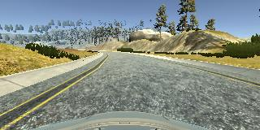

# **Behavioral Cloning** 

## Writeup Template

### You can use this file as a template for your writeup if you want to submit it as a markdown file, but feel free to use some other method and submit a pdf if you prefer.

---

**Behavioral Cloning Project**

The goals / steps of this project are the following:
* Use the simulator to collect data of good driving behavior
* Build, a convolution neural network in Keras that predicts steering angles from images
* Train and validate the model with a training and validation set
* Test that the model successfully drives around track one without leaving the road
* Summarize the results with a written report


[//]: # (Image References)

[image1]: ./examples/placeholder.png "Model Visualization"
[image2]: ./examples/placeholder.png "Grayscaling"
[image3]: ./examples/placeholder_small.png "Recovery Image"
[image4]: ./examples/placeholder_small.png "Recovery Image"
[image5]: ./examples/placeholder_small.png "Recovery Image"
[image6]: ./examples/placeholder_small.png "Normal Image"
[image7]: ./examples/placeholder_small.png "Flipped Image"

## Rubric Points
### Here I will consider the [rubric points](https://review.udacity.com/#!/rubrics/432/view) individually and describe how I addressed each point in my implementation.  

---
### Files Submitted & Code Quality

#### 1. Submission includes all required files and can be used to run the simulator in autonomous mode

My project includes the following files:
* clone.py containing the script to create and train the model
* drive.py for driving the car in autonomous mode
* model.h5 containing a trained convolution neural network 
* writeup.md  summarizing the results

#### 2. Submission includes functional code
Using the Udacity provided simulator and my drive.py file, the car can be driven autonomously around the track by executing 
```sh
python drive.py model.h5
```
Before starting the simulator, I started ```export LANG=en_US.utf8``` in order to avoid localization issues, especially with commas for numerical values which are not used in Germany.

#### 3. Submission code is usable and readable

The model.py file contains the code for training and saving the convolution neural network. The file shows the pipeline I used for training and validating the model, and it contains comments to explain how the code works.

### Model Architecture and Training Strategy

#### 1. An appropriate model architecture has been employed

My model was taken directly from the course, chapter 15: Even More Powerful Network. It consists of a convolution neural network with 3x3 filter sizes and depths between 24 and 64 (model.py lines 75-79) 

The model includes RELU layers to introduce nonlinearity (code line 75-79), and the data is normalized in the model using a Keras lambda layer (code line 46). 

#### 2. Attempts to reduce overfitting in the model

The model was trained and validated on 2 different data sets to ensure that the model was not overfitting. The model was tested by running it through the simulator and ensuring that the vehicle could stay on the track.

#### 3. Model parameter tuning

The model used an adam optimizer, so the learning rate was not tuned manually (clone.py line 87).

#### 4. Appropriate training data

Training data was chosen to keep the vehicle driving on the road. I used a combination of center lane driving, recovering from the left and right sides of the road ... 

For details about how I created the training data, see the next section. 

### Training Strategy

I followed the recommendations in the course: First I drove both courses in standard direction. I saw that there was an overfitting to driving left curves. So I followed the advice of driving counterclockwise. So this gave me symmetric behaviour, but the car often left the street.

So I followed the next hint only recording when driving inwards to learn this behaviour. Autonomous driving got better and better, but only after approx. 50000 training images the driving got acceptable.

I also played with the number of epochs. In the course it is said that 7 is enough. I increased to 20, which didn't bring much. So I finally let it be to 10 epochs.

At the end of the process, the vehicle is able to drive autonomously around the track without leaving the road.


#### 3. Creation of the Training Set & Training Process

To capture good driving behavior, I first recorded two laps on track one using center lane driving. Here is an example image of center lane driving:

![alt text] (images/center_2018_08_23_17_47_39_634.jpg)

I then recorded the vehicle recovering from the left side and right sides of the road back to center so that the vehicle would learn to get away from the lane boundaries to the center. These images show what a recovery looks like starting from left and right each:


![alt text] (images/center_2018_08_23_01_02_31_508.jpg)

Then I repeated this process on track two in order to get more data points, especially more curves, more slope/steepness, more shadows etc.

I didn't use any data augmentation techniques this time, as in the Traffic Sign Recognition project. But possible candidates would be: horizontal flipping, changing contrast/brightness etc.


I used this training data for training the model. The ideal number of epochs was 10 by experiment. I used an adam optimizer so that manually training the learning rate wasn't necessary.
