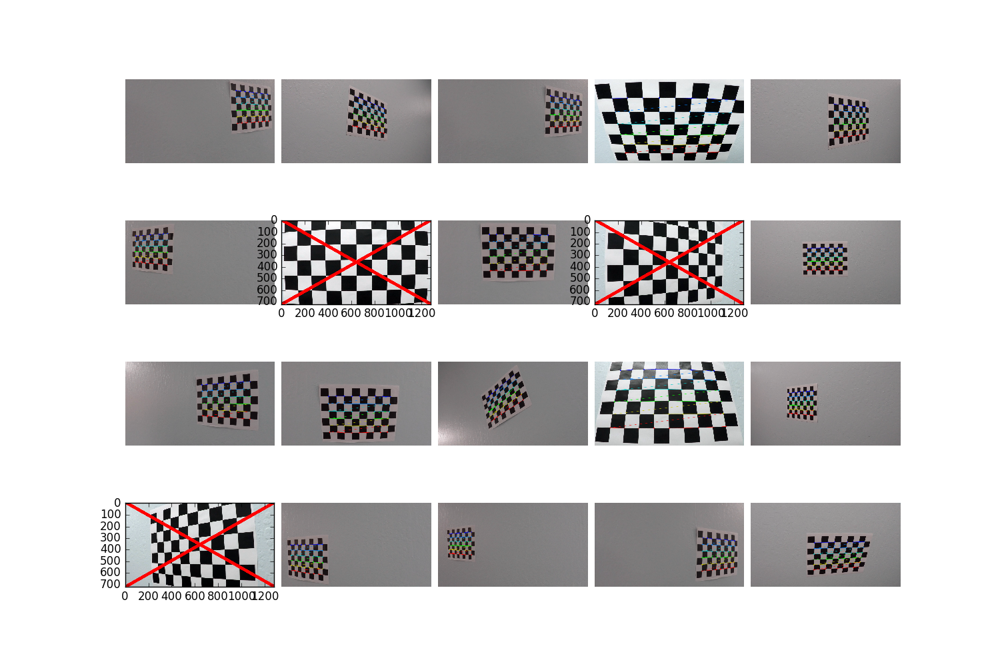
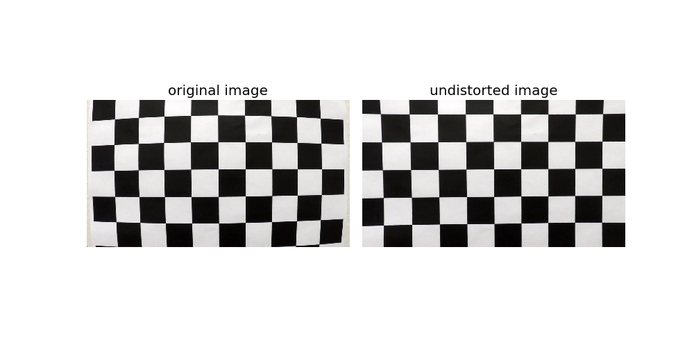
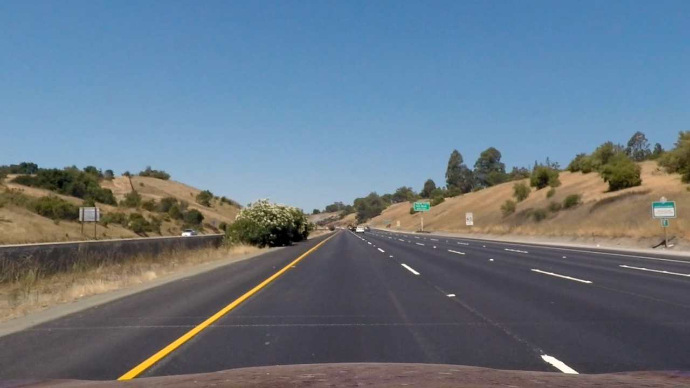
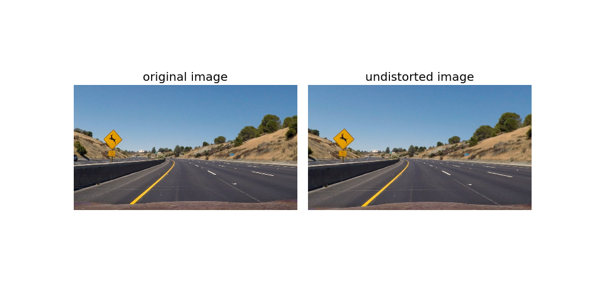
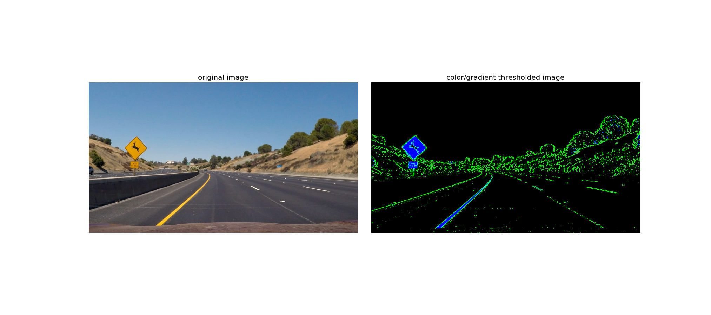
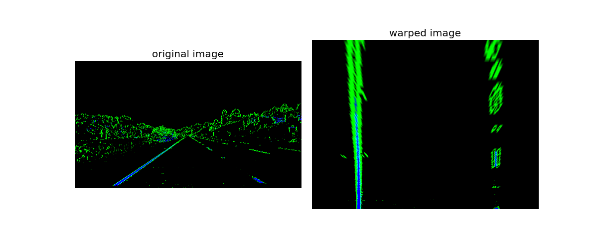
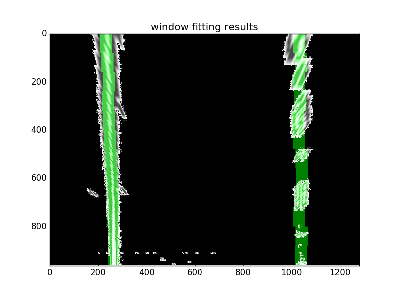
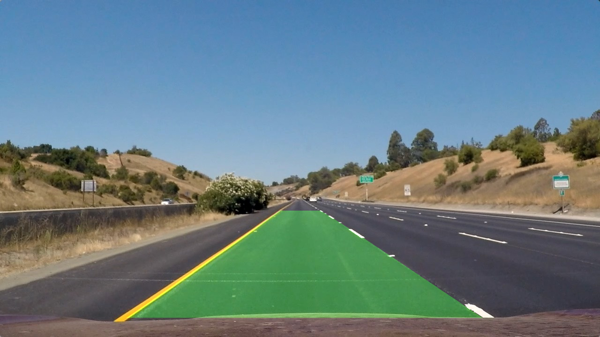
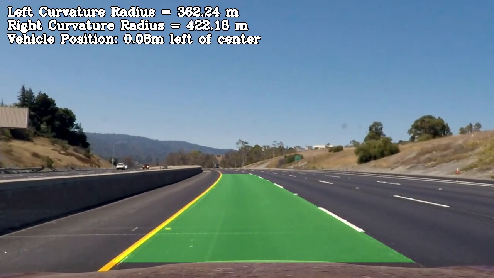
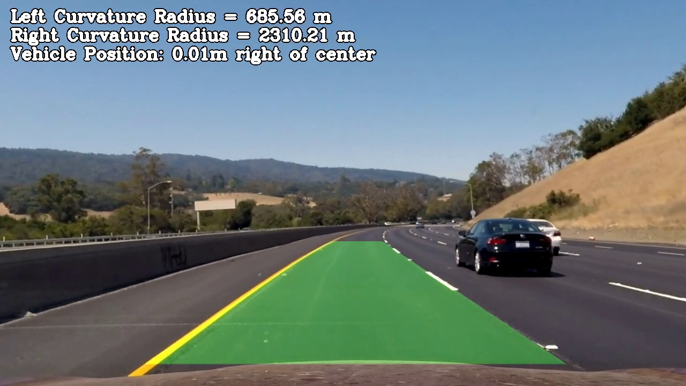

## Writeup Template

### You can use this file as a template for your writeup if you want to submit it as a markdown file, but feel free to use some other method and submit a pdf if you prefer.

---

**Advanced Lane Finding Project**

The goals / steps of this project are the following:

* Compute the camera calibration matrix and distortion coefficients given a set of chessboard images.
* Apply a distortion correction to raw images.
* Use color transforms, gradients, etc., to create a thresholded binary image.
* Apply a perspective transform to rectify binary image ("birds-eye view").
* Detect lane pixels and fit to find the lane boundary.
* Determine the curvature of the lane and vehicle position with respect to center.
* Warp the detected lane boundaries back onto the original image.
* Output visual display of the lane boundaries and numerical estimation of lane curvature and vehicle position.

[//]: # (Image References)

[image1]: ./examples/undistort_output.png "Undistorted"
[image2]: ./test_images/test1.jpg "Road Transformed"
[image3]: ./examples/binary_combo_example.jpg "Binary Example"
[image4]: ./examples/warped_straight_lines.jpg "Warp Example"
[image5]: ./examples/color_fit_lines.jpg "Fit Visual"
[image6]: ./examples/example_output.jpg "Output"
[video1]: ./project_video.mp4 "Video"

## [Rubric](https://review.udacity.com/#!/rubrics/571/view) Points

### Here I will consider the rubric points individually and describe how I addressed each point in my implementation.  

---

### Writeup / README

#### 1. Provide a Writeup / README that includes all the rubric points and how you addressed each one.  You can submit your writeup as markdown or pdf.  [Here](https://github.com/udacity/CarND-Advanced-Lane-Lines/blob/master/writeup_template.md) is a template writeup for this project you can use as a guide and a starting point.  

As a general approach, I decided to use as much source code as possible from the lectures / code snippets / quizes. I put it into the files apply_sobel.py, color_and_gradient.py, curve_pixels.py, direction_gradient.py, findchessboardcorners.py, lane_histogram.py, magnitude_gradient.py, prev_poly.py, radius_curve.py, rgb_to_hls.py, sliding_window.py, sliding_window_template.py, undistort.py, and warp.py.
Then, after commenting the "main glue" in these files, I imported all the relevant methods from there in a main file "main.py". Sometimes, the functions were not perfectly suitable (e.g. did not return variables but kept them locally), so I sometimes made  a second version.
The main.py consists of a path for testing with single images (when the variable testsingleimage == False, approx. line 237), and a path for processing videos. For the latter path, I used the same mechanisms as in the first project, using VideoFileClip from moviepy.editor. To summarize, my approach worked perfectly for "project_video.mp4", was OK for "challenge_video.mp4", and failed for "harder_challenge_video.mp4", with all the shadows, reflections, and extreme curves.
As a remark, I didn't create a jupyter notebook, but rather a usual python file, because I want to batch call it later with my own camera setup.
As a second remark, I didn't do the optional task of reusing previous detected lanes, but rather do a full search each frame. Reason: Final deadline is coming soon in 2 weeks for final project "Vehicle Detection", so I have to hurry.

### Camera Calibration

#### 1. Briefly state how you computed the camera matrix and distortion coefficients. Provide an example of a distortion corrected calibration image.

The code for this step is contained in the method "calibrate_camera", approx. line 44 in main.py. The calibration is done as in the lecture using findChessboardCorners calibrateCamera from OpenCV.
"findChessboardCorners" assumes that the calibration pattern is fully visible, so some calibration images could not be used, as crossed out in red in the following image:
 
Also, I refined the corner detection by using "cornerSubPix". As camera calibration is time consuming, I save the results in a file using pickle, and reload it afterwards (can be overridden by recalc=True).  
 I applied this distortion correction to the test image using the `cv2.undistort()` function and obtained this result: 
 

### Pipeline (single images)

#### 1. Provide an example of a distortion-corrected image.

To demonstrate this step, I will describe how I apply the distortion correction to one of the test images like this one:
Original:

Undistorted:
 
Compare line 265 in main.py
Here another example with a curve:
 

In the left half, it can be slightly seen that straight lines are straight and therefore the image fulfills the property of a projection (i.e. rectified).

#### 2. Describe how (and identify where in your code) you used color transforms, gradients or other methods to create a thresholded binary image.  Provide an example of a binary image result.

I used a combination of color and gradient thresholds to generate a binary image (thresholding steps at lines 10 through 30 in `color_and_gradient.py`).  Here's an example of my output for this step:
 
This is called in main.py in line 283 (under step 3).
#### 3. Describe how (and identify where in your code) you performed a perspective transform and provide an example of a transformed image.

The code for my perspective transform is in "warp.py", corners_unwarp_improved, which is in line 46 there. I remembered the lessons transforming a stop sign and/or transforming a calibration pattern. I therefore picked source points manually with an image viewer containing a relevant trapezoid with the street,  and the destination points in the following manner:

```python
srcpts = np.float32([[600.0, 450.0],
                         [686.0, 450.0],
                         [1040.0, 680.0],
                         [270.0, 680.0]])
    dstpts = np.float32([[270.0, 0.0],
                         [1040.0, 0.0],
                         [1040.0, 720.0],
                         [270.0, 720.0]])
```

This resulted in the following source and destination points (upper left, upper right, lower right, lower left corner):

| Source        | Destination   | 
|:-------------:|:-------------:| 
| 600, 450      | 270, 0        | 
| 686, 450      | 1040, 0      |
| 1040, 680     | 1040, 720      |
| 270, 680      | 270, 0        |

I verified that my perspective transform was working as expected by warping the previous result of the combined gradient/color thresholding: the lines appear parallel in the warped image.

 

#### 4. Describe how (and identify where in your code) you identified lane-line pixels and fit their positions with a polynomial?

The identification of lane-line pixels is in line 312 (below "step 5"). I used the sliding_window.py from the lecture, without exploiting previously detected lanes (final deadline is coming soon!).

 

#### 5. Describe how (and identify where in your code) you calculated the radius of curvature of the lane and the position of the vehicle with respect to center.

I did this in lines 354 through 356 in my code in `main.py`using the method from the lecture. For this, I extended the "measure_curvature_real" to "measure_curvature_real2" to accept real word ploty, left_fitx, and right_fitx instead of fake random data.

#### 6. Provide an example image of your result plotted back down onto the road such that the lane area is identified clearly.

I implemented this step in lines 361 through 362 in my code in `main.py`.  Here is an example of my result on a test image:



The following images show it together with the measurements:



Although I have no ground truth, it seems to be plausible: in left curves there is a slight tendency of the driver to the left, and vice versa to the right.

---

### Pipeline (video)

#### 1. Provide a link to your final video output.  Your pipeline should perform reasonably well on the entire project video (wobbly lines are ok but no catastrophic failures that would cause the car to drive off the road!).

All the above steps for processing single test images I collected and put into "process_image" (line 203 in main.py), without any intermediate plotting.

Here's a [link to my video result](./output_videos/project_video_output.mp4)

The curvature radius is below 1000m (except some outliers), which makes sense according to the section "Tips and Tricks for the Project, section "Do your curvature values make sense". 
I also uploaded this video to youtube:
 [Youtube video](https://youtu.be/OtmIisVNC-A) 


---

### Discussion

#### 1. Briefly discuss any problems / issues you faced in your implementation of this project.  Where will your pipeline likely fail?  What could you do to make it more robust?

Essentially, I used a gradient/color thresholding in the colorspace HLS and exploited the saturation channel to be robust against different colors of lane lines.
The lane detection is inspired by the sliding window approach from the lectures, simple form, without any memory from past frames (final deadline in less than 2 weeks, and one project to go).
For the potential future: What could be improved is the lane detetion itself. For extreme curves such as in the third video, it could be difficult to detect by this "vertical histogram-oriented" approach, here the search range could be extended a little bit. Also, some temporal filtering could make the results more stable, especially for difficult frames with shadows, reflections, occlusions etc.